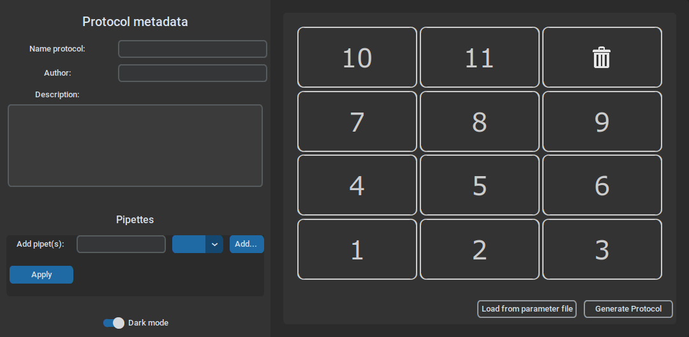

# fastKris
FastKris is a Python tool to automate crystalisation screens using OpenTrons robotics, saving much time, annoying concentration calculations and repetitive pipetting labour.
A GUI allows to easily define a screening experiment and to build a functional OpenTrons protocol script, which is ready-to-use for the [OT-2 pipetting robot](https://opentrons.com/).

**No coding experience required, only click-and-play!**

**--> Read the user's guide!**


| _Initial window of the GUI_

## Features

1. GUI
	- Defining experiments using graphics, clicks and fill-in boxes
	- Generating protocol scripts
	- Exporting and importing parameter files
2. Protocol definitions
	- Three types of variable compound types (Salt, Precipitant & Buffer) and one invariable one (Diluent)
	- Flexibility to interchange compound types
	- Three supported screen types (1D, 2D, 3D)
	
	| _Supported screen types_
3. Protocol execution
	- Protocol consistency checks
	- Tip and time saving behaviour
	- Droplet spills avoiding behaviour
	- Basic liquid level tracker
	- Automatic optimal pipette selection
4. Quick click-and-play experience or verbose simulation run in a terminal

## Installation
Just download the contents of this repository to a location you can easily find back. Always keep the GUI and the script builder together.

### Dependencies
Nice-to-haves:

- A spreadsheeting program (Excel and alike)
- The [OpenTrons app](https://opentrons.com/ot-app/)

Essentials:

- Python 3 (>= 3.8.10)
- Python modules
	- [NumPy](https://numpy.org/install/) (>= 1.17.4)
	- [OpenTrons API](https://docs.opentrons.com/v2/writing.html#installing) (>= 6.1.0)
	- [customTkinter](https://github.com/TomSchimansky/CustomTkinter) (>= 4.6.3)
	- [XlsxWriter](https://xlsxwriter.readthedocs.io/getting_started.html) (>= 3.0.3)
	- [easygui](https://pypi.org/project/easygui/) (>= 0.98.3)

Install these Python modules all at once using the following command.

```
pip install numpy opentrons customtkinter XlsxWriter easygui
```
## Usage

**--> For a tutorial and more instructions about how to use this tool: read the official user's guide.**

### Export a library of compounds.
FastKris requires compounds to be registered in its compound library. This is a simple tab-separated text file named `compLibrary.txt` with header "Label - Compound type - Stock concentration", that should be located **in the same folder as the script builder `ScriptBuilder.py`**. 
It is recommended to save your compound library as a spreadsheet and to export it to a tab-separated file (usually the `*.txt` or `*.tsv` "Save as" option).
### Define your experiment and generate a protocol script.
#### GUI method
Start the GUI by double-clicking it, choose your working directory and fill in your experiment definitions (see the user's guide). Click the `Generate protocol` button and give a name to your experiment. This generates the following files:

- A parameter text file defining your experiment: `<experiment-name>.param.txt`. This allows to reload previously defined experiments using the `Load from parameter file` button.
- A spreadsheet with the compound concentrations for each well: `<experiment-name>.xlsx`.
- The ready-to-use protocol script: `<experiment-name>.py`.

#### Terminal method
Building a protocol from a parameter text file is also possible from a terminal.

To generate a protocol `protocol.py` from a parameter file `params.txt`, `cd` to the folder containing the script builder and type

```
python ScriptBuilder.py params.txt protocol.py
```
These filenames are the default ones, so in that case, you can also just type

```
python ScriptBuilder.py
```
### Execute your protocol
#### OpenTrons
*There are multiple ways to [execute an OpenTrons script](https://docs.opentrons.com/v2/writing.html#simulate-block), but FastKris has been tested using the OpenTrons app and benefits from its protocol analysis step.*

Import your protocol in the OpenTrons app, which will run consistency checks while loading. If these fail, an error message will be displayed. Redefine and regenerate your protocol using the previous steps to mitigate this.

*There is no need to delete and reimport your protocol in the OpenTrons app. By clicking `Show in folder` from the menu top right, you can access the folder in which the app saves your protocol file. Just overwrite this file with your regenerated protocol and click `Reanalyze` from this same menu to update the protocol in the app.*

After a successful protocol analysis, click `Run protocol` and then your OpenTrons device. This will upload your protocol to the OpenTrons.

**Do not forget to load the instrument calibrations before starting the actual execution!** To do so, open the calibration menu below, which triggers a prompt to load these, to pop up. It is recommended to redo calibration after each start-up of your OpenTrons device.
#### Verbose simulation terminal
You can test your protocol more extensively by simulating it in a terminal. Every protocol script is stuffed with stdout logs, which can be displayed in a terminal. These logs include

- Matrices in the format of the well plate indicating which concentration is prepared for each compound in each well.
- Total stock volume requirements, so that you can check whether there is enough stock left.
- A summary log for each volume transfer.
- A more detailed sequence of action logs undertaken by the OpenTrons.

Access the simulation shell by `cd`'ing to your protocol and type

```
opentrons_simulate protocol.py
```
